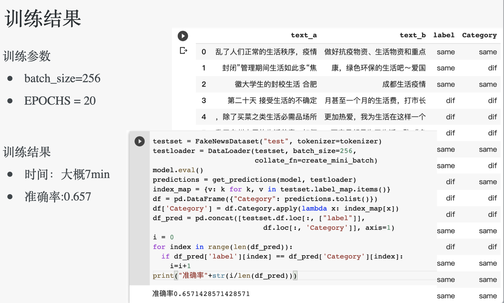

# NLP-BERT-CHINESE-WSD
this is a nlp project using bert to perform chinese wsd (this word is "生活") on the dataset spidered from weibo.com (keywords: "上海","防疫","封闭管理","","疫情")


```
├── bert.ipynb
├── PPT汇报.pdf
├── PPT汇报.pptx
├── data
│   ├── 上海.csv
│   ├── 清零.csv
│   ├── 疫情.csv
│   ├── 防疫.csv
│   ├── 上海2.csv
│   ├── 防疫2.csv
│   ├── 疫情3.csv
│   ├── 封闭管理.csv
│   └── 封闭管理2.csv
└── output
    ├── Frequency-output.csv
    ├── text.png
    ├── text2.png
    ├── 生活.csv
└── 生活.xlsx

```



